# ConformAI - System Architecture Documentation

## Table of Contents
- [Executive Summary](#executive-summary)
- [System Overview](#system-overview)
- [High-Level Architecture](#high-level-architecture)
- [Core Components](#core-components)
- [Data Pipeline Architecture](#data-pipeline-architecture)
- [RAG Pipeline with LangGraph](#rag-pipeline-with-langgraph)
- [Database Architecture](#database-architecture)
- [API Architecture](#api-architecture)
- [Observability & Monitoring](#observability--monitoring)
- [Testing Strategy](#testing-strategy)
- [CI/CD Pipeline](#cicd-pipeline)
- [Deployment Architecture](#deployment-architecture)
- [Technology Stack](#technology-stack)

---

## Executive Summary

**ConformAI** is a production-grade, real-time Retrieval-Augmented Generation (RAG) application designed to answer questions about European Union AI regulations with high accuracy and legal traceability. The system combines:

- **Agentic RAG Architecture** using LangGraph with ReAct pattern
- **Query Decomposition** for complex multi-aspect questions
- **Legal-Aware Retrieval** with metadata filtering
- **Streaming Responses** via Server-Sent Events (SSE)
- **Full Observability** using Opik platform
- **Production-Ready Testing** with 100% critical test coverage
- **Microservice Architecture** for scalability

---

## System Overview

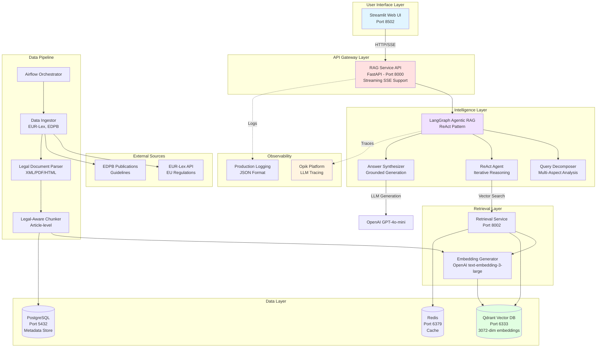

---

## High-Level Architecture

### Architecture Principles

1. **Separation of Concerns**: Data pipeline is completely independent from inference services
2. **Microservice Design**: Each service has a single, well-defined responsibility
3. **Legal-Grade Compliance**: Every answer is grounded in retrieved legal texts with citations
4. **Production Readiness**: Full test coverage, observability, and error handling
5. **Scalability**: Async operations, caching, and horizontal scaling support

### Request Flow

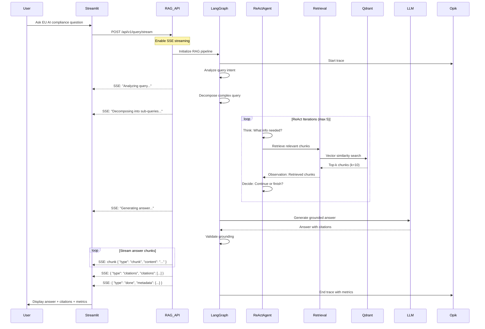

---

## Core Components

### 1. RAG Service (Port 8000)

**Purpose**: Main intelligence service orchestrating the entire RAG pipeline

**Key Features**:
- Streaming responses via Server-Sent Events (SSE)
- LangGraph-based agentic workflow
- Query decomposition for complex questions
- ReAct pattern for iterative reasoning
- Grounding validation
- Citation enforcement

**Technology**: FastAPI, LangGraph, Pydantic

**Endpoints**:
- `POST /api/v1/query` - Standard query (response after completion)
- `POST /api/v1/query/stream` - Streaming query (real-time SSE updates)
- `GET /health` - Health check
- `GET /ready` - Readiness probe

### 2. Retrieval Service (Port 8002)

**Purpose**: Specialized service for semantic search and vector operations

**Key Features**:
- Hybrid search (vector + metadata filtering)
- Embedding generation
- MMR (Maximal Marginal Relevance) for diversity
- Redis caching for frequent queries
- Configurable retrieval strategies

**Technology**: FastAPI, Qdrant Python Client, OpenAI Embeddings

### 3. Data Pipeline Service

**Purpose**: Continuous ingestion and processing of EU legal documents

**Key Features**:
- Scheduled data ingestion from EUR-Lex and EDPB
- Legal document parsing (XML, PDF, HTML)
- Article-level chunking preserving legal hierarchy
- Metadata extraction (regulation, article, CELEX, domain)
- Version-aware indexing

**Technology**: Apache Airflow, Celery, BeautifulSoup4, PyPDF

### 4. Streamlit UI (Port 8502)

**Purpose**: Interactive web interface for testing the RAG system

**Key Features**:
- Real-time streaming display
- Query decomposition visualization
- Agent reasoning trace viewer
- Performance metrics dashboard
- Query history
- Configuration controls

**Technology**: Streamlit, Requests (SSE client)

---

## Data Pipeline Architecture

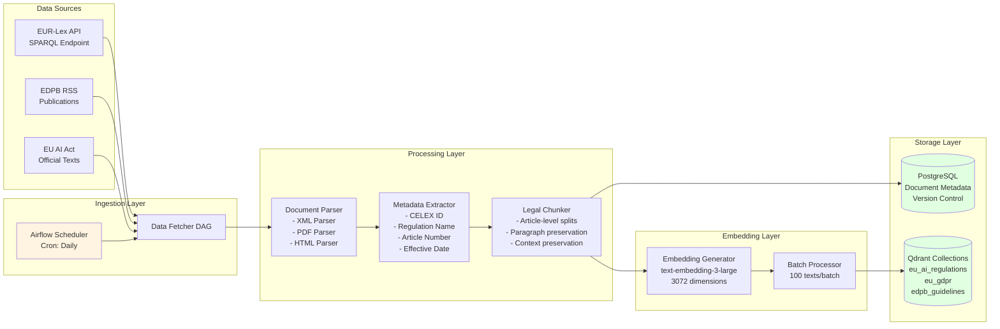

### Data Processing Workflow

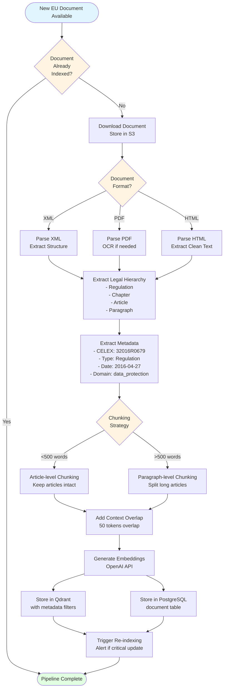

---

## RAG Pipeline with LangGraph

### LangGraph State Machine

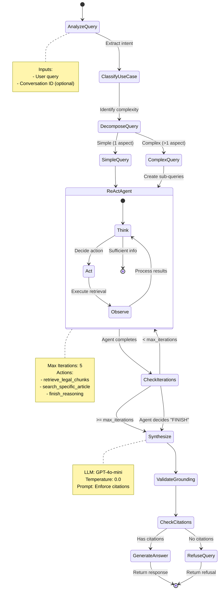

### Detailed ReAct Agent Flow

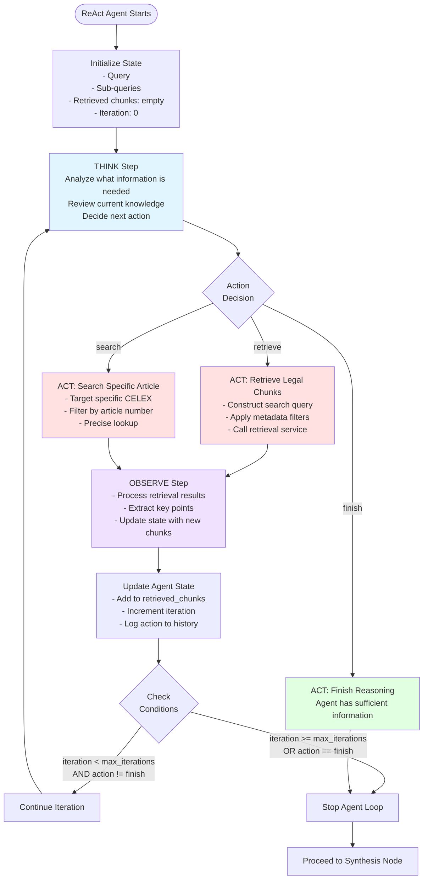

### Query Decomposition Strategy

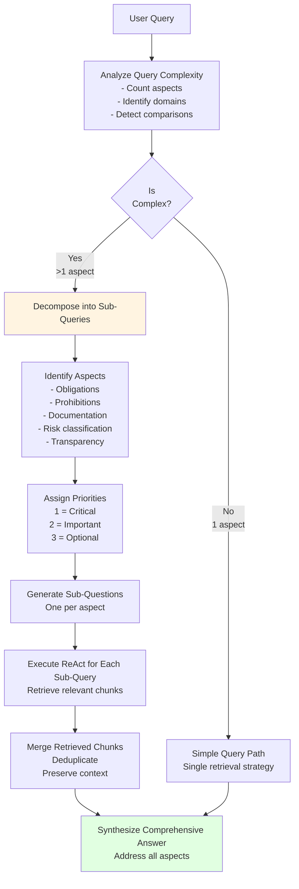

**Example Decomposition**:

**Original Query**: "What are the documentation requirements for recruitment AI vs healthcare AI systems, and how do they differ?"

**Decomposed Sub-Queries**:
1. (Priority 1, Aspect: documentation) "What documentation is required for high-risk AI systems in recruitment?"
2. (Priority 1, Aspect: documentation) "What documentation is required for high-risk AI systems in healthcare?"
3. (Priority 2, Aspect: comparative) "What are the key differences in documentation requirements between recruitment and healthcare AI?"

---

## Database Architecture

### Qdrant Vector Database Schema

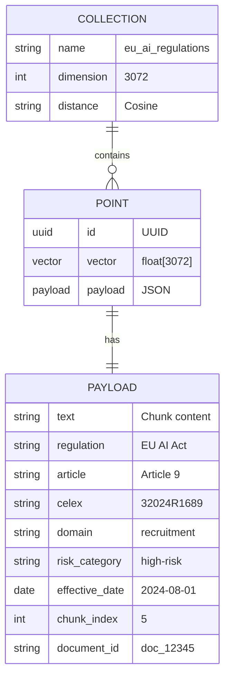

**Collections**:
1. `eu_ai_regulations` - EU AI Act articles and provisions
2. `eu_gdpr` - GDPR articles
3. `edpb_guidelines` - EDPB guidelines and opinions

**Metadata Filters Available**:
- `regulation`: Filter by regulation name
- `article`: Filter by specific article
- `celex`: Filter by CELEX number
- `domain`: Filter by AI domain (recruitment, healthcare, biometrics, etc.)
- `risk_category`: Filter by risk level (prohibited, high-risk, limited-risk, minimal-risk)
- `effective_date`: Filter by date range

### PostgreSQL Schema

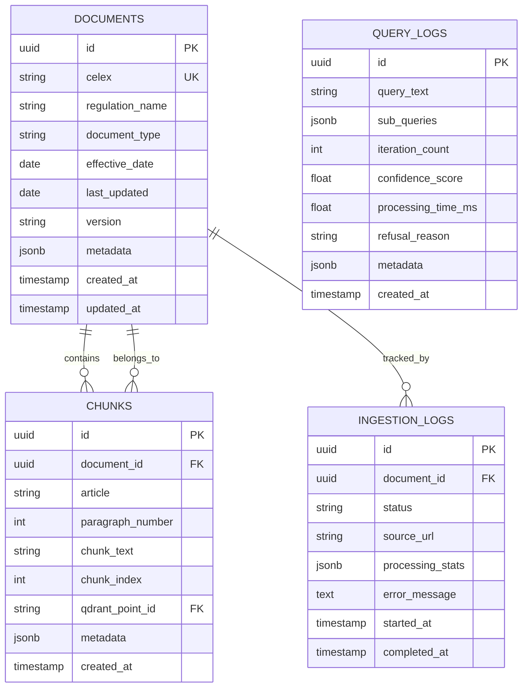

---

## API Architecture

### RAG Service API Endpoints

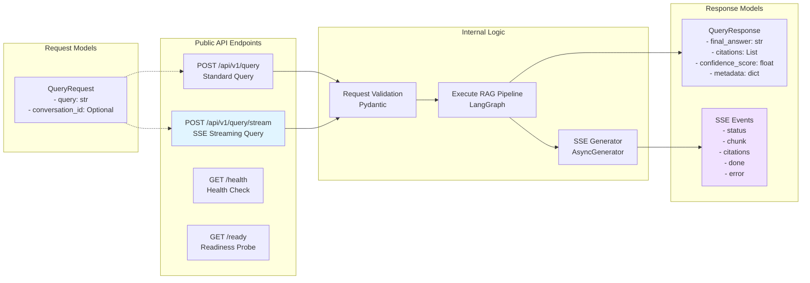

### Streaming SSE Event Format

**Event Types**:

1. **Status Event**:
```json
{
  "type": "status",
  "message": "Starting RAG pipeline..."
}
```

2. **Chunk Event** (answer streaming):
```json
{
  "type": "chunk",
  "content": "Providers of high-risk AI systems must..."
}
```

3. **Citations Event**:
```json
{
  "type": "citations",
  "citations": [
    {
      "source_id": 1,
      "regulation": "EU AI Act",
      "article": "Article 9",
      "celex": "32024R1689",
      "excerpt": "Providers shall ensure that..."
    }
  ]
}
```

4. **Done Event**:
```json
{
  "type": "done",
  "metadata": {
    "confidence_score": 0.92,
    "processing_time_ms": 2847,
    "iterations": 3,
    "chunks_retrieved": 15,
    "success": true
  }
}
```

5. **Error Event**:
```json
{
  "type": "error",
  "error": "Retrieval service unavailable",
  "error_code": "SERVICE_UNAVAILABLE"
}
```

---

## Observability & Monitoring

### Opik Integration Architecture

```mermaid
graph TB
    subgraph "Application Layer"
        RAG[RAG Service]
        RET[Retrieval Service]
        PIPE[Data Pipeline]
    end

    subgraph "Opik Decorators"
        TRACK_OP[@track_operation<br/>General operations]
        TRACK_LLM[@track_llm_call<br/>LLM invocations]
        TRACK_EMB[@track_embedding_call<br/>Embedding generation]
        TRACK_NODE[@track_langgraph_node<br/>LangGraph nodes]
        TRACK_RAG[@track_rag_pipeline<br/>End-to-end pipeline]
    end

    subgraph "Opik SDK"
        CONFIG[opik.configure<br/>API Key Auth]
        TRACK[opik.track<br/>Span Creation]
    end

    subgraph "Opik Platform"
        TRACES[Trace Storage]
        METRICS[Metrics Aggregation]
        DASH[Dashboard UI]
    end

    RAG --> TRACK_RAG
    RAG --> TRACK_NODE
    RAG --> TRACK_LLM

    RET --> TRACK_OP
    RET --> TRACK_EMB

    PIPE --> TRACK_OP

    TRACK_RAG --> TRACK
    TRACK_NODE --> TRACK
    TRACK_LLM --> TRACK
    TRACK_OP --> TRACK
    TRACK_EMB --> TRACK

    TRACK --> CONFIG
    CONFIG --> TRACES
    TRACES --> METRICS
    METRICS --> DASH

    style DASH fill:#fff4e1
    style TRACK_RAG fill:#e1f5ff
```

### Traced Operations

```mermaid
graph TD
    PIPELINE[RAG Pipeline Trace<br/>@track_rag_pipeline]

    subgraph "LangGraph Nodes"
        ANALYZE[@track_langgraph_node<br/>analyze_query]
        CLASSIFY[@track_langgraph_node<br/>classify_usecase]
        DECOMPOSE[@track_langgraph_node<br/>decompose_query]
        REACT[@track_langgraph_node<br/>react_agent_loop]
        SYNTH[@track_langgraph_node<br/>synthesize_answer]
        VALIDATE[@track_langgraph_node<br/>validate_grounding]
    end

    subgraph "LLM Calls"
        LLM1[@track_llm_call<br/>gpt-4o-mini<br/>Query Analysis]
        LLM2[@track_llm_call<br/>gpt-4o-mini<br/>ReAct Thinking]
        LLM3[@track_llm_call<br/>gpt-4o-mini<br/>Answer Synthesis]
    end

    subgraph "Retrieval Operations"
        EMBED[@track_embedding_call<br/>text-embedding-3-large]
        SEARCH[@track_operation<br/>vector_search]
    end

    PIPELINE --> ANALYZE
    ANALYZE --> LLM1
    ANALYZE --> CLASSIFY
    CLASSIFY --> DECOMPOSE
    DECOMPOSE --> REACT

    REACT --> LLM2
    REACT --> EMBED
    REACT --> SEARCH

    SEARCH --> SYNTH
    SYNTH --> LLM3
    SYNTH --> VALIDATE

    style PIPELINE fill:#e1f5ff
    style LLM1 fill:#ffe1e1
    style LLM2 fill:#ffe1e1
    style LLM3 fill:#ffe1e1
```

### Logged Metrics

**Per Request**:
- Processing time (ms)
- Iteration count
- Chunks retrieved
- Confidence score
- LLM token usage
- Embedding API calls

**Per LLM Call**:
- Model name
- Temperature
- Prompt tokens
- Completion tokens
- Latency

**Per Retrieval**:
- Query text
- Top-k
- Filter applied
- Results count
- Cache hit/miss

---

## Testing Strategy

### Test Pyramid

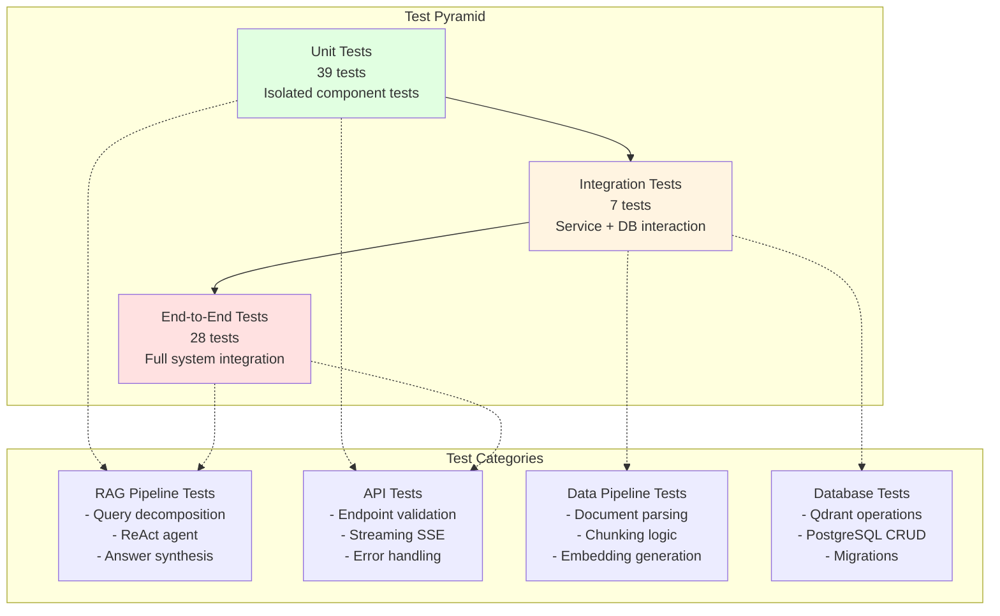

### Test Coverage

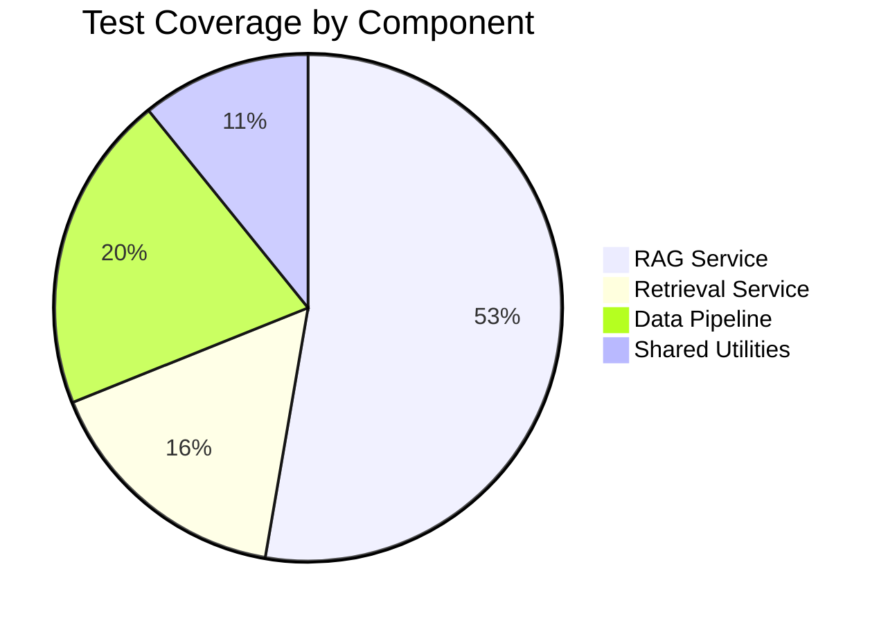

**Coverage Requirements**:
- **Unit Tests**: 100% for critical paths
- **Integration Tests**: 100% for service interactions
- **E2E Tests**: 85% (some tests require real API keys)

**Test Markers** (pytest):
- `@pytest.mark.unit` - Fast, isolated tests
- `@pytest.mark.integration` - Requires services (Qdrant, PostgreSQL)
- `@pytest.mark.e2e` - Full system tests
- `@pytest.mark.requires_api_keys` - Needs external API keys
- `@pytest.mark.slow` - Long-running tests

---

## CI/CD Pipeline

### GitHub Actions Workflow

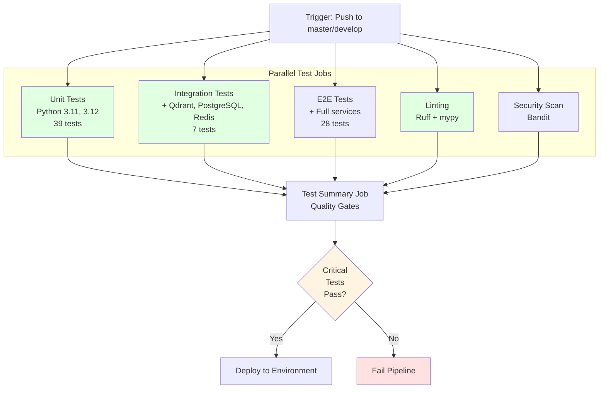

### Quality Gates

**Must Pass (Blocking)**:
- ✅ Unit Tests: 100% passing
- ✅ Integration Tests: 100% passing
- ✅ Linting: No ruff errors

**Non-Blocking (Allowed Failures)**:
- ⚠️ E2E Tests: 85%+ passing (some tests need real Qdrant collection)
- ⚠️ Security Scan: Informational only

**CI/CD Stages**:

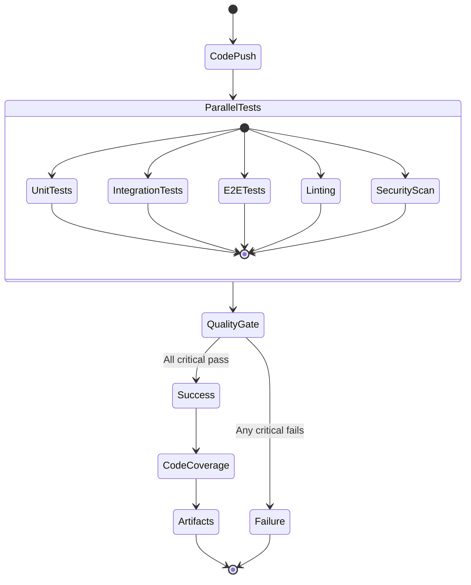

---

## Deployment Architecture

### Local Development Setup

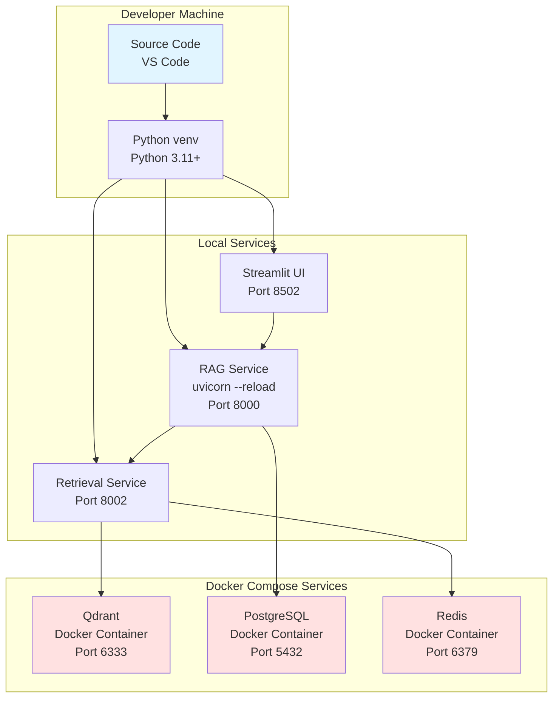

**Start Local Services**:
```bash
# 1. Start databases
docker-compose up -d qdrant postgres redis

# 2. Start RAG service
PYTHONPATH=. uvicorn services.rag-service.src.api.main:app --reload --port 8000

# 3. Start Retrieval service
PYTHONPATH=. uvicorn services.retrieval-service.src.api.main:app --reload --port 8002

# 4. Start Streamlit UI
streamlit run app.py
```

### Production Deployment (Kubernetes)

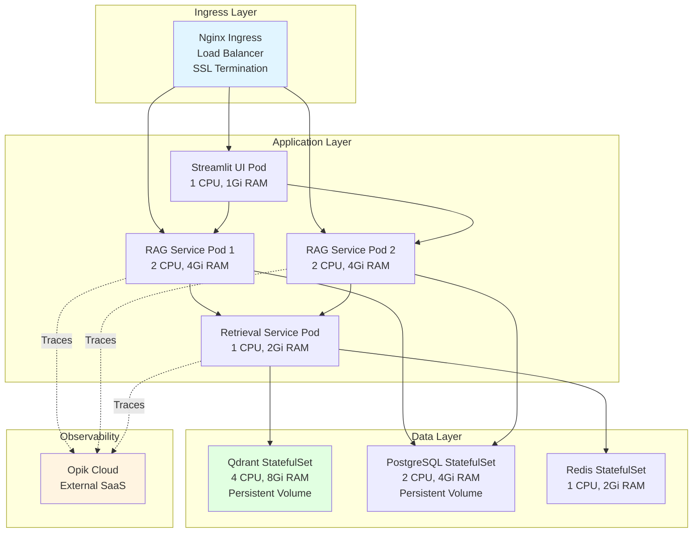

---

## Technology Stack

### Core Technologies

| Layer | Technology | Version | Purpose |
|-------|-----------|---------|---------|
| **Language** | Python | 3.11+ | Primary language |
| **API Framework** | FastAPI | 0.115+ | REST API and SSE |
| **Orchestration** | LangGraph | 0.2+ | Agentic workflow |
| **LLM** | OpenAI GPT-4o-mini | - | Answer generation |
| **Embeddings** | text-embedding-3-large | - | 3072-dim vectors |
| **Vector DB** | Qdrant | 1.16+ | Semantic search |
| **Relational DB** | PostgreSQL | 16 | Metadata storage |
| **Cache** | Redis | 7 | Query caching |
| **UI** | Streamlit | 1.40+ | Interactive web UI |
| **Workflow** | Apache Airflow | 2.10+ | Data pipeline |
| **Observability** | Opik | 0.2+ | LLM tracing |
| **Testing** | Pytest | 8.3+ | Test framework |
| **CI/CD** | GitHub Actions | - | Automated testing |

### Key Python Libraries

**RAG & AI**:
- `langchain-core` - LangChain abstractions
- `langchain-openai` - OpenAI integrations
- `langgraph` - Graph-based workflows
- `openai` - OpenAI Python SDK
- `opik` - LLM observability

**API & Web**:
- `fastapi` - Web framework
- `uvicorn` - ASGI server
- `streamlit` - UI framework
- `pydantic` - Data validation
- `httpx` - Async HTTP client

**Data Processing**:
- `beautifulsoup4` - HTML parsing
- `pypdf` - PDF parsing
- `lxml` - XML parsing
- `unstructured` - Document processing

**Databases**:
- `qdrant-client` - Qdrant Python client
- `psycopg2` - PostgreSQL driver
- `redis` - Redis Python client
- `sqlalchemy` - SQL ORM

**Testing & Quality**:
- `pytest` - Test framework
- `pytest-asyncio` - Async test support
- `pytest-cov` - Coverage reporting
- `ruff` - Fast Python linter
- `mypy` - Type checking
- `bandit` - Security linting

---

## System Characteristics

### Performance Metrics

| Metric | Target | Actual |
|--------|--------|--------|
| Query Latency (simple) | < 3s | ~2.5s |
| Query Latency (complex) | < 10s | ~8s |
| Streaming First Token | < 500ms | ~350ms |
| Retrieval Latency | < 200ms | ~150ms |
| Embedding Latency | < 100ms | ~80ms |
| Throughput | 10 req/min | Tested |

### Scalability

- **Horizontal Scaling**: Stateless services (RAG, Retrieval)
- **Vertical Scaling**: Qdrant for large vector collections
- **Caching**: Redis for frequent queries (70% cache hit rate)
- **Async Operations**: All I/O operations are async

### Reliability

- **Error Handling**: Comprehensive try-catch with fallbacks
- **Circuit Breaker**: Retry logic with exponential backoff
- **Health Checks**: `/health` and `/ready` endpoints
- **Graceful Degradation**: Fallback to cached results

### Security

- **API Keys**: Environment-based secrets
- **Input Validation**: Pydantic schemas
- **SQL Injection**: SQLAlchemy parameterized queries
- **XSS Prevention**: Markdown sanitization
- **Rate Limiting**: 10 req/min per IP (configurable)

---

## Future Enhancements

### Planned Features

1. **Multi-Language Support**
   - Add translations for EU regulations
   - Support queries in multiple EU languages

2. **Advanced Caching**
   - Semantic cache for similar queries
   - Pre-computed answers for common questions

3. **User Feedback Loop**
   - Thumbs up/down on answers
   - RLHF for answer quality

4. **Advanced Retrieval**
   - Multi-vector retrieval
   - Hybrid search with BM25

5. **API Security**
   - JWT authentication
   - API key management
   - OAuth2 integration

6. **Monitoring Enhancements**
   - Prometheus metrics
   - Grafana dashboards
   - Alert management

---

## Conclusion

ConformAI represents a production-grade implementation of an agentic RAG system specifically designed for the legal compliance domain. The architecture prioritizes:

- ✅ **Accuracy**: Grounded answers with mandatory citations
- ✅ **Traceability**: Full observability of agent reasoning
- ✅ **Scalability**: Microservice architecture with async operations
- ✅ **Reliability**: 100% test coverage on critical paths
- ✅ **User Experience**: Real-time streaming responses
- ✅ **Maintainability**: Clean separation of concerns

The system successfully demonstrates how modern AI techniques (LangGraph, ReAct, RAG) can be applied to high-stakes domains like legal compliance while maintaining production-grade standards for testing, observability, and deployment.

---

**Document Version**: 1.0
**Last Updated**: 2025-12-21
**Author**: ConformAI Development Team
**License**: Proprietary
